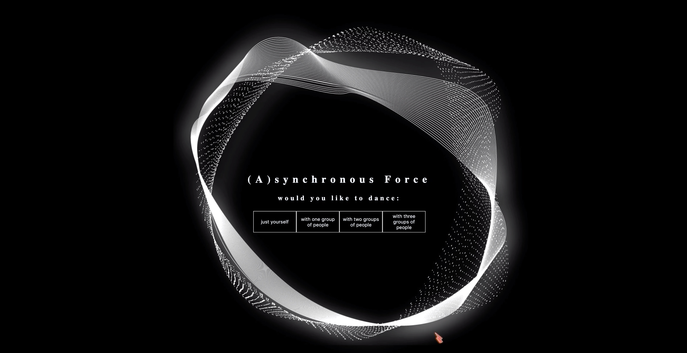
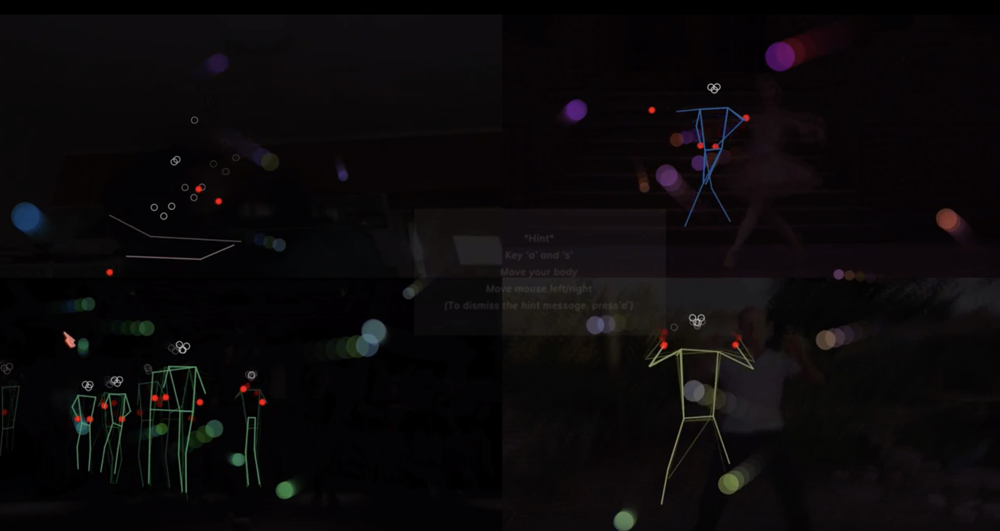

## (A)synchronous Force :dancer:

### Movement Practice and Physical Computation - PoseNet Project
### NYUSH Spring 2020

### Running
[Heroku](https://daisy-posenetproject.herokuapp.com/)

### Instruction

1. On the intro page, choose how many people you want to interact with(namely the total number of videos you want to put on the page)
2. Use key ‘a’ and ‘s’ to control the display of lines
3. Use mouse position to control the opacity of the background video(left=black background, no image of video, right = show the original video)
4. Move your body to see how the movement and interaction happen

### Reference
- Nature of Code Tutorials
- PoseNet documentation
